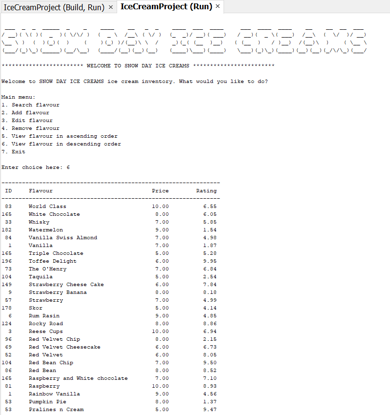
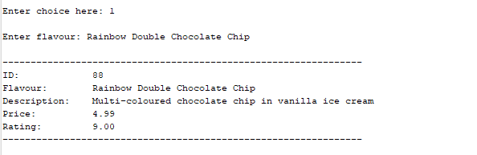
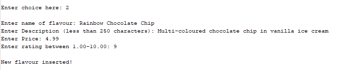
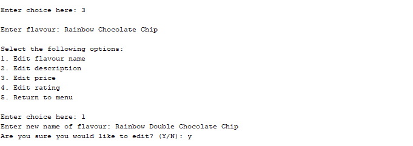

# Ice Cream Inventory System in C

This was a team project with two of my friends: CA, JL. It was the final project in the data structures and algorithms programming in C course.

This is an console application with CRUD functions and file i/o for ice cream shops to keep track of their inventory by attributes such as flavour name, rating (popularity). 

My responsibilities were 
- File i/o 
  Input: Read from csv file, tokenize, and load data to initialize every struct nodes and insert node into binary search tree
  Output: Traverse tree nodes to write each one to lines in csv file, delete tree (via memory management)
- Add new flavour with data validation
- Display List of all flavours

Screenshots:

